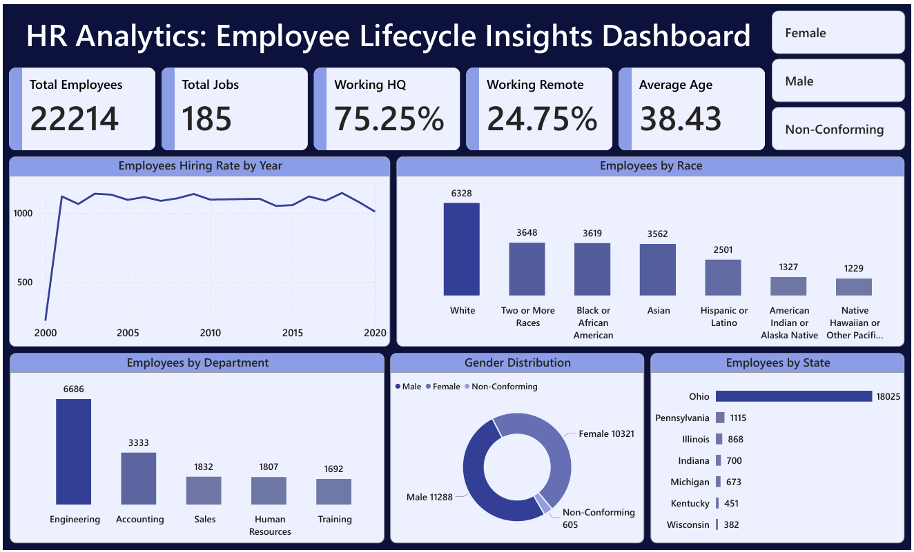

# HR Analytics: Employee Lifecycle Insights Dashboard  
### 📊 Workforce Insights through Data-Driven HR Analytics  
**By Kirti Sundar Dey**
📊 *Internship Project at Rubixe – AI Solutions Company*

---

## 🌟 Project Snapshot  
An end-to-end **HR Analytics project** that transforms raw employee data into actionable workforce insights using **SQL (MySQL Workbench)** and **Power BI**.

The project analyzes **employee lifecycle, hiring trends, workforce diversity, department distribution, and remote vs HQ work patterns**, supported by an **interactive dashboard** and a **professional presentation**.

---

## 🎯 Business Objective  
Organizations today rely on **HR Analytics** to:
- Optimize hiring strategies  
- Improve workforce planning  
- Track diversity & inclusion  
- Understand remote work adoption  
- Reduce employee attrition  

This project demonstrates how **data-backed HR insights** can support better strategic decisions.

---

## 🏷️ Skills & Tools  
`HR Analytics` `People Analytics` `SQL` `MySQL Workbench`  
`Power BI` `Dashboard Design` `Data Cleaning`  
`Business Intelligence` `Data Storytelling`

---

## 📁 Dataset Overview  
- **Total Records:** 22,214 employees  
- **Total Columns:** 13  
- **Domain:** Human Resources Analytics

### Dataset Includes:
- Employee demographics (Age, Gender, Race)  
- Department & Job Title  
- Hire & Termination Dates  
- Work Location (HQ / Remote)  
- City & State information  

---

## 🔄 Project Workflow  

### 🗄️ 1. Data Extraction  
- Imported HR dataset into **MySQL Workbench**  
- Reviewed schema, column types, and data quality  

### 🧹 2. Data Cleaning & Transformation (SQL)  
Key transformations performed:
- Converted date fields to standard formats  
- Calculated **employee age** from birthdate  
- Standardized department, race, and state values  
- Handled NULL termination dates  
- Identified active vs terminated employees  
- Exported clean dataset for visualization  

📄 **SQL Script Used:** [`Data Preparation`](./DataPreparation/data_preparation.sql)
📄 **Cleaned Data:** [`Data After Cleaning`](./CleanedData/hr_analytics_cleaned.csv)

### 📊 3. Dashboard Development (Power BI)  
- Built **KPI-driven HR dashboard**
- Designed executive-ready visuals  
- Implemented slicers for gender filtering  
- Focused on clarity, storytelling, and insights  

### 📑 4. Presentation Creation  
- Created a **detailed PowerPoint presentation**
- Explained business context, insights, and recommendations  
- Suitable for **stakeholder & management review**

📄 **Presentation File:** [`HR Analytics Presentation.pptx`](./Presentation)

---

## 📌 Key KPIs  

| Metric | Value |
|------|------|
| 👥 Total Employees | **22,214** |
| 🧑‍💼 Total Job Roles | **185** |
| 🏢 Working from HQ | **75.25%** |
| 🏠 Working Remotely | **24.75%** |
| 🎂 Average Age | **38.43 Years** |

---

## 📊 Dashboard Visuals  
✔ Hiring Rate by Year  
✔ Gender Distribution  
✔ Employees by Department  
✔ Employees by State  
✔ Employees by Race  

🖼️ **Dashboard Image:**  

---

## 🔍 Key Insights  

### 👨‍👩‍👧 Workforce Demographics  
- Workforce is relatively **young (30–35 years avg)**  
- Younger employees dominate technical roles  
- Senior roles show higher age brackets  

### 📈 Hiring Trends  
- Strong hiring growth between **2010–2020**  
- Dip during **COVID-19 (2020–2021)**  
- Post-2021 recovery indicates expansion  

### ⚖️ Gender & Diversity  
- Gender imbalance exists in technical roles  
- Good racial diversity across workforce  
- Leadership roles can improve diversity representation  

### 🏢 Department Analysis  
- **Engineering & Sales** are the largest departments  
- Core drivers of company operations  

### 🏠 Work Location Insights  
- High remote adoption improves talent reach  
- HQ roles represent operational & leadership needs  

---

## 💡 Business Recommendations  
- Strengthen **diversity hiring** initiatives  
- Focus on **retention strategies** for key departments  
- Continue supporting **remote work models**  
- Invest in **training programs** for young workforce  
- Monitor workload in Engineering & Sales teams  

---

## 🧩 Tools & Technologies  

| Tool | Purpose |
|----|----|
| **MySQL Workbench** | Data extraction & cleaning |
| **SQL** | Transformation & calculations |
| **Power BI** | Dashboard & KPI visualization |
| **PowerPoint** | Insights presentation |
| **CSV / Excel** | Data validation & export |

---

## 📬 Contact  
**👤 Kirti Sundar Dey**  
📊 Data Analyst | Power BI | SQL | Excel  
🎓 Internship Project by **Rubixe – AI Solutions Company**  
📍 Bengaluru, India  

🔗 [LinkedIn](https://www.linkedin.com/in/kirti-sundar-dey-0954122a5)
